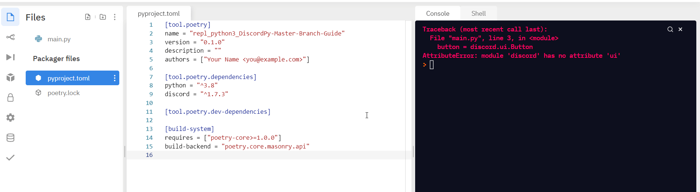

<h1>Guide to Install Discord Py Master Branch on Replit</h1>


<h2>Step 1</h2>

Create an empty repl on replit


<h2>Step 2</h2>

Add this Basic Code to the file main.py so as to check if discord.py master branch is installed or not

```
import discord

button = discord.ui.Button
```


<h2>Step 3</h2>

Run the code so as to build Packager Files


Don't worry about the error . It will be resolved after completing the further steps!

<h2>Step 4</h2>

Now open `pyproject.toml` file and replace `discord = "^1,7,3"` with `discord = {git = "https://github.com/Rapptz/discord.py"}`



<h2>Step 5</h2>

Open Shell and install discord.py master branch through pip
```
pip install git+https://github.com/Rapptz/discord.py
```


<h2>Step 6</h2>

Run the main.py to check if master branch has been installed!


Boom! The code ran without any errors, that means discord.py master branch has been installed successfully!!

Now you can create bots on replit based on discord.py 2.0 !!